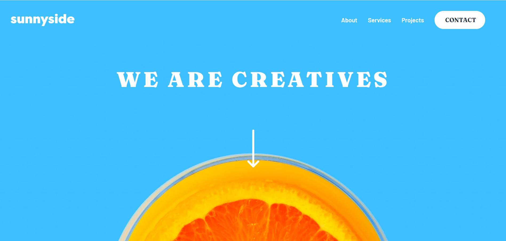

# Frontend Mentor - Sunnyside agency landing page solution

This is a solution to the [Sunnyside agency landing page challenge on Frontend Mentor](https://www.frontendmentor.io/challenges/sunnyside-agency-landing-page-7yVs3B6ef). 

## Table of contents

- [Overview](#overview)
  - [The challenge](#the-challenge)
  - [Screenshot](#screenshot)
  - [Links](#links)
- [My process](#my-process)
  - [Built with](#built-with)
  - [What we practiced](#what-we-practiced)
  - [Continued development](#continued-development)
  - [Useful resources](#useful-resources)
- [Authors](#authors)
- [Acknowledgments](#acknowledgments)

## Overview

### The challenge

Users should be able to:

- View the optimal layout for the site depending on their device's screen size
- See hover states for all interactive elements on the page

### Screenshot

### Links

- Solution URL: [Sunnyside_agency_landing_page](https://github.com/Darionas/sunnyside_agency_landing_page)
- Live Site URL: [Sunnyside_agency_landing_page](https://darionas.github.io/sunnyside_agency_landing_page/)

## My process

Collab project was created by **josh76543210**, **Abdoulaye33**, **darionas** from Frontend Mentor.

* Create drawing from design (structure of design)
 * Create of repo
 * Create HTML layout
 * Create CSS layout according style guides
 * Create layout for mobile first
 * Craete layout for desktop
 * Implement JavaScript

 For RWD were used different techniques: flex, grid, media query, cause of coders experience.

### Built with

- Semantic HTML5 markup
- CSS custom properties:
   - Flex
   - CSS Grid
   - Media query
- JavaScript

But created with :heart:

### What we practiced

Hey, we practice collab on GitHub platform. As we have different experience we have used different techniques in css to achieve RWD: flex, grid, media query. And we succeded. Thank you **josh76543210**, **Abdoulaye33** for collab.

### Continued development

Continue collab on GitHub platform.

### Useful resources

None

## Authors

- Frontend Mentor - [@josh76543210](https://www.frontendmentor.io/profile/josh76543210)

- Frontend Mentor - [@Abdoulaye](https://www.frontendmentor.io/profile/Abdoulaye)

- Frontend Mentor - [@Darionas](https://www.frontendmentor.io/profile/Darionas)

## Acknowledgments

- Thank you Frontend Mentor team for opportunity to try, practice, train yourself in different level challenges and gain invaluable experience.
